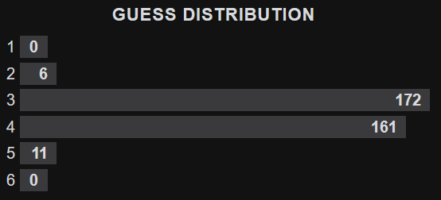
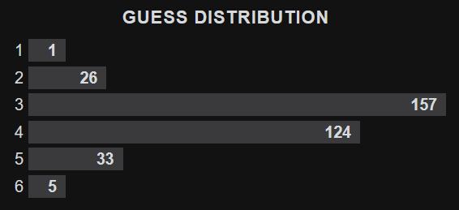
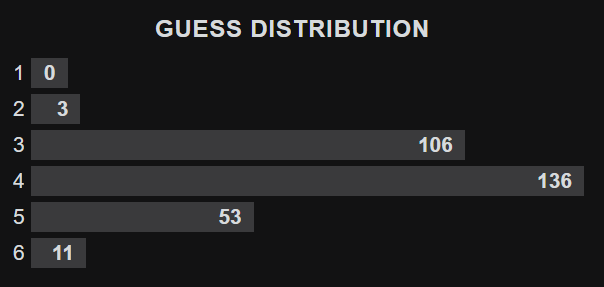

# Wordle

## Files

### data/word_lists:

word_list.txt -> List of words that can be the answer

word_list_complete.txt -> List of all words including those that can be guessed but can't be the answer

### Main files:

game.py -> The game of Wordle to play in the terminal

probability.py -> Program to calculate how often each letter is found in the word list

bot.py -> Bot for the game Wordle that can guess the answer (best version)

automated_bot.py -> Bot from bot.py automated to press the buttons to play the game

bot_hard.py -> Bot for the game Wordle that plays in hard mode

automated_bot_hard.py -> Bot from bot_hard.py automated to press the buttons to play the game

starting_word.py -> Program that calculates the best starting word for bot.py (the top 3 words are trace, salet and crate)

### Old Bots:

random_bot.py -> Bot for the game Wordle that guesses a random possible word

wordle_bot.py / filler_bot.py / filler_bot_2.py / filler_bot_final.py / good_bot.py -> Previous versions of bots that can guess a filler word to increase their performance

automated_bot.py / automated_good_bot.py -> Automated versions from filler_bot_final.py and good_bot.py solving the game continuously (by pressing the buttons for you)

/!\ The automated versions of the bot are designed to work for the website wordleunlimited.org and NOT for the official Wordle website. To play there, the manual version must be used /!\

## Performance

The data was gathered using the website worldeunlimited.org and the automated versions of the bots.

### Current best bot

This data was gathered using the Bot from automated_bot.py.
The average number of guesses per word from the 350 games played is around 3,51.

#### Hard Mode

This data was gathered using the Bot from automated_bot_hard.py in the hard mode of Wordle.
The average number of guesses per word from the 350 games played is around 3.51, which is almost identical to the bot in normal mode, meaning there doesn't seem to be a big difference between the two modes.

### Previous best bot

This data was gathered with the Bot from automated_good_bot.py.
The average number of guesses per word from the 309 games played is around 3,88.