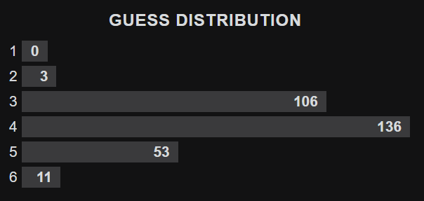

# Wordle

game.py -> The game of Wordle (unfinished)

word_list.txt -> List of words that can be the answer

word_list_complete.txt -> List of words that can't be the answer but can be guessed

probability.py -> Program to calculate how often each letter is found in the word list

bot.py -> Bot for the game Wordle that can guess the answer (best version)

bot_automated.py -> Bot from bot.py automated to press the buttons to play the game

starting_word.py -> Program that calculates the best starting word for bot.py (the top 3 words are trace, salet and crate)

random_bot.py -> Bot for the game Wordle that guesses a random possible word

filler_bot.py / filler_bot_2.py / filler_bot_final.py / good_bot.py -> Previous versions of bots that can guess a filler word to increase their performance

automated_bot.py / automated_good_bot.py -> Automated versions from filler_bot_final.py and good_bot.py solving the game continuously (by pressing the buttons for you)

## Performance

This data was gathered with the Bot from good_bot.py using the website wordleunlimited.org.
The average number of guesses per word from the 309 games played is around 3.88.